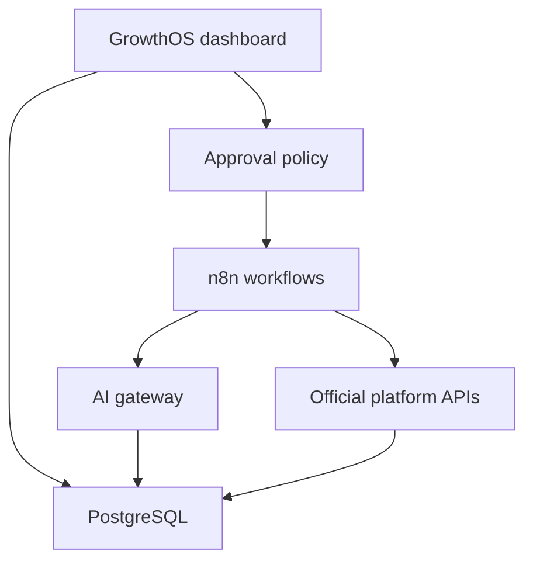

# GrowthOS architecture

## Product boundary

GrowthOS is the human control centre and system of record. PostgreSQL owns durable business memory. n8n will execute deterministic workflows. AI providers will perform bounded reasoning and content tasks. Official APIs will handle distribution.

## First measurable loop

The first release is successful only when it traces a campaign through to a qualified lead and eventual sales outcome.

1. Store evidence and market intelligence.
2. Build a campaign brief.
3. Generate channel-specific drafts.
4. Require human approval.
5. Publish through an approved connector.
6. Capture and qualify leads.
7. Record follow-up and sales outcomes.
8. Attribute results back to the campaign.

## Module boundaries

- `src/app`: routes and server-rendered interface
- `src/components`: reusable interface components
- `src/domain`: pure policy and state machines
- `src/lib/auth`: authentication boundary
- `src/lib/tenant`: workspace authorization
- `src/lib/db`: PostgreSQL connection and repositories
- `database`: schema, migrations, and seed data
- `tests`: policy-focused automated tests

## Deliberately deferred

- OpenClaw coordination
- Autonomous public actions
- Social-network credentials
- Email delivery
- WhatsApp and voice
- Commercial billing

These are later integrations, not prerequisites for validating the core growth loop.

